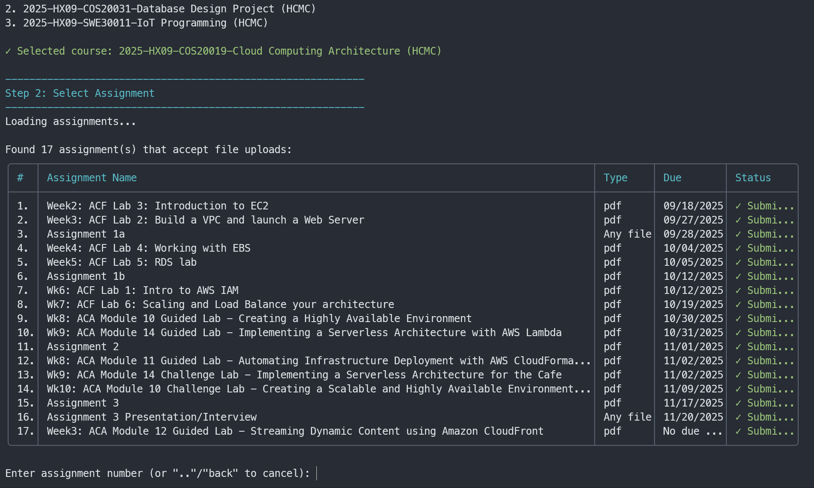
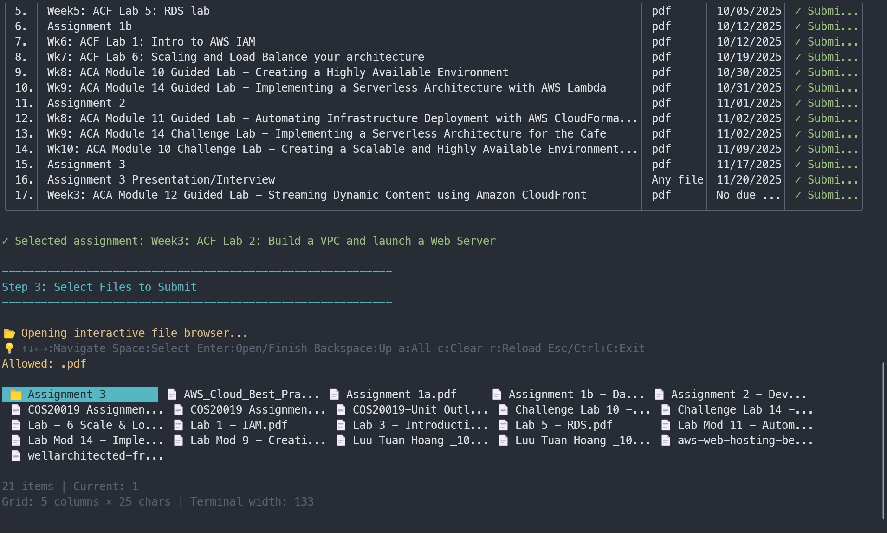
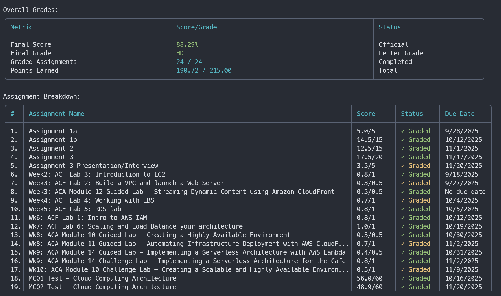
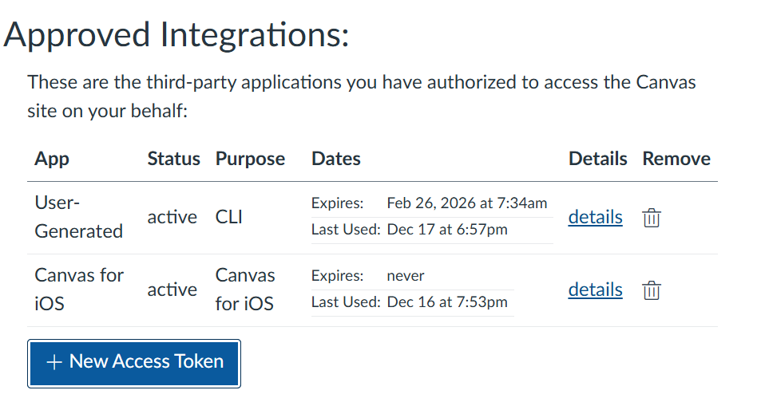

# Canvas CLI Tool

A modern, user-friendly command-line interface for Canvas LMS. Manage courses, assignments, submissions, grades, and more directly from your terminal.

## Features

- List and filter enrolled/starred courses
- View assignments, grades, and submission status
- Interactive file upload for assignments with visual file browser
- View upcoming due dates and calendar events
- Browse course modules and content
- View course announcements
- Display user profile information
- Modern table displays with adaptive column widths
- Direct access to Canvas API endpoints

## Preview

### Assignment Submission Interface



### Interactive Files Selection



### Detailed Grades View



## Installation

### Global (Recommended)

```bash
npm install -g canvaslms-cli
```

## Setup

The setup wizard will guide you through:

1. **Getting your Canvas API Token**
   - Log into your Canvas
   - Go to Account → Settings
   - Scroll down to "Approved Integrations"
   - Click "+ New Access Token"
   - Copy the generated token

   

2. **Configure the CLI**

   ```bash
   canvas config setup
   ```

3. **Entering your credentials**
   - Canvas domain (e.g., `school.instructure.com`)
   - Your API token

## Usage

### Configuration

The CLI stores your Canvas domain and API token in `~/.canvaslms-cli-config.json`. You can manage configuration with:

```bash
canvas config setup              # Initial setup wizard
canvas config edit               # Edit existing configuration
canvas config show               # Display current configuration
canvas config set <key> <value>  # Set a configuration value (domain, token, truncate)
```

**Table Display Options:**

- **Wrap mode** (default): Text wraps to multiple lines within the column
- **Truncate mode**: Text is truncated with "..." when it exceeds column width

You can toggle this during `canvas config setup`, `canvas config edit`, or use `canvas config set truncate <true|false>`.

### Common Commands

```bash
canvas config                    # Configure domain and API token
canvas list                      # List starred courses
canvas list -a                   # List all enrolled courses

# Assignments (supports course name instead of ID)
canvas assignments               # Interactive course selection
canvas assignments math        # List assignments for course matching math
canvas assignments -s            # Show only submitted assignments
canvas assignments -p            # Show only pending assignments

# Grades (supports course name instead of ID)
canvas grades                    # Interactive course selection + detailed grades
canvas grades database         # Show detailed grades for course matching database
canvas grades -a                 # Include inactive/completed courses
canvas grades -v                 # Include verbose enrollment details

# Announcements (supports course name instead of ID)
canvas announcements             # Interactive course selection
canvas announcements software  # Show announcements for course matching software
canvas announcements -l 10       # Show last 10 announcements

# Calendar & Due Dates
canvas calendar                  # View upcoming due dates (next 14 days)
canvas calendar -d 30            # View due dates for next 30 days
canvas calendar -p               # Include past due items (last 7 days)
canvas calendar -a               # Include all courses (not just starred)

# Modules
canvas modules                   # Interactive course selection
canvas modules algorithms      # Browse modules for course matching algorithms

# Todo List
canvas todo                      # View all pending items across courses
canvas todo -l 10                # Show only 10 items

# Files
canvas files                     # Interactive course file browser
canvas files math              # Browse files for course matching math

# Groups
canvas groups                    # View your group memberships
canvas groups -m                 # Show group members
canvas groups -v                 # Show detailed group info

# Submission
canvas submit                    # Interactive assignment submission
canvas submit tools            # Submit to course matching tools
canvas submit -f file.pdf        # Submit specific file
canvas submit --dry-run          # Test submission without uploading

# Profile
canvas profile                   # Show user profile
canvas profile -v                # Show all profile fields
```

## License

See [LICENSE](LICENSE) for details.
